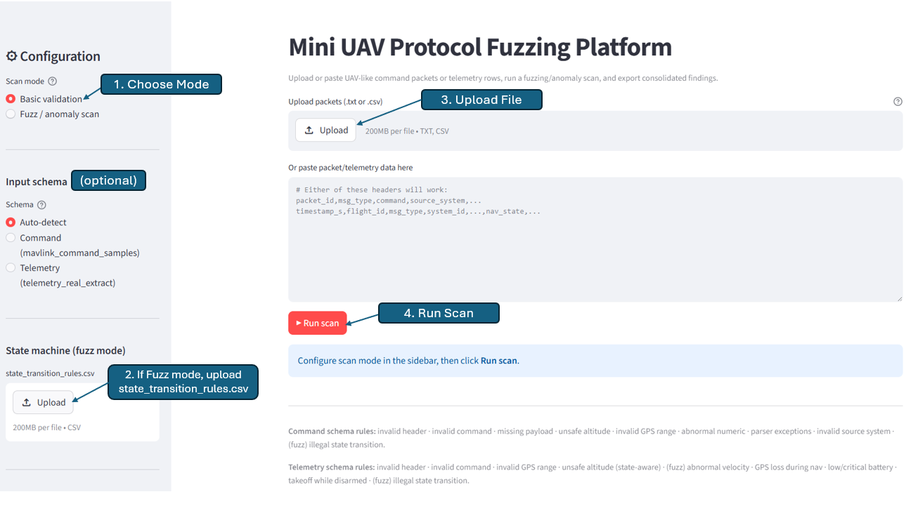
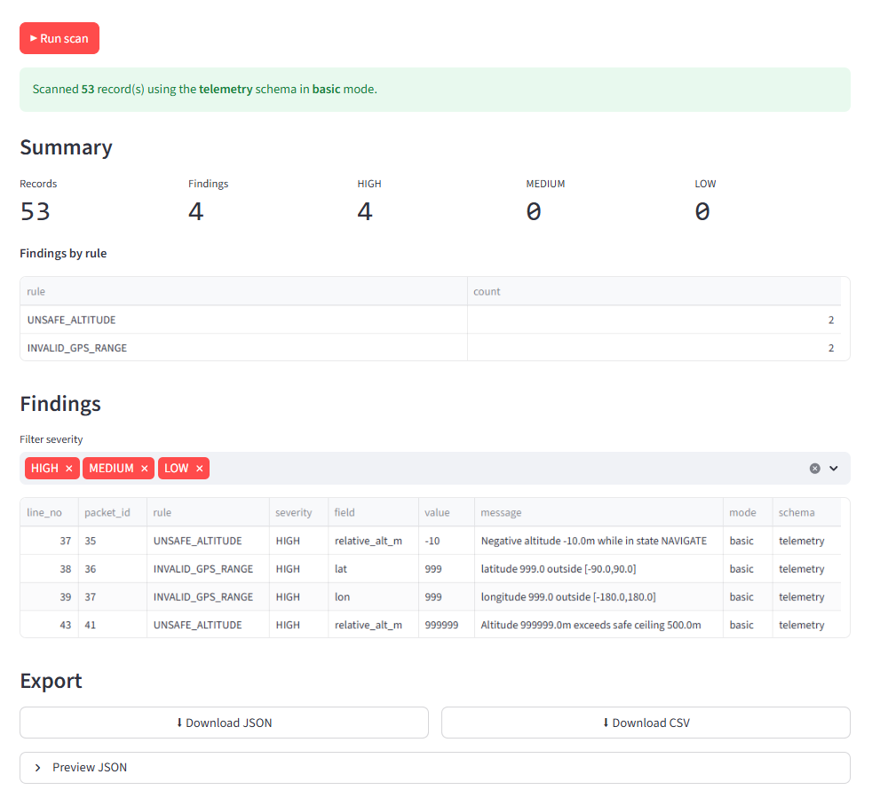
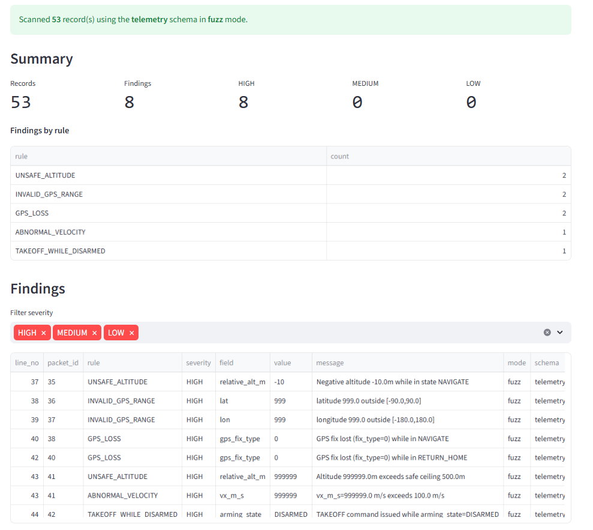
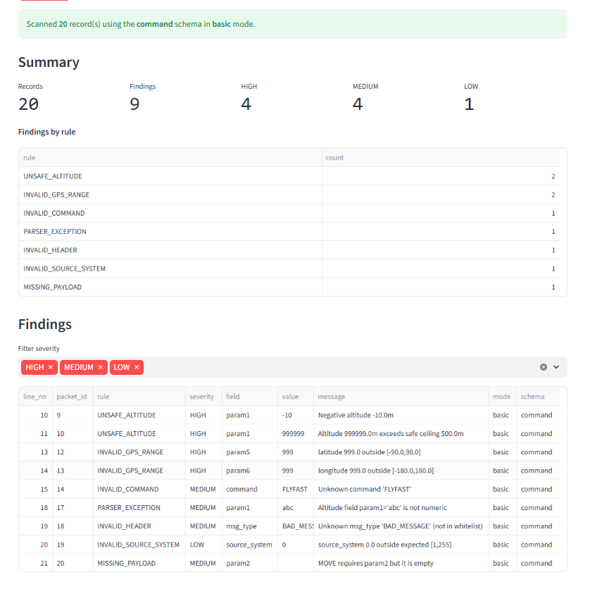
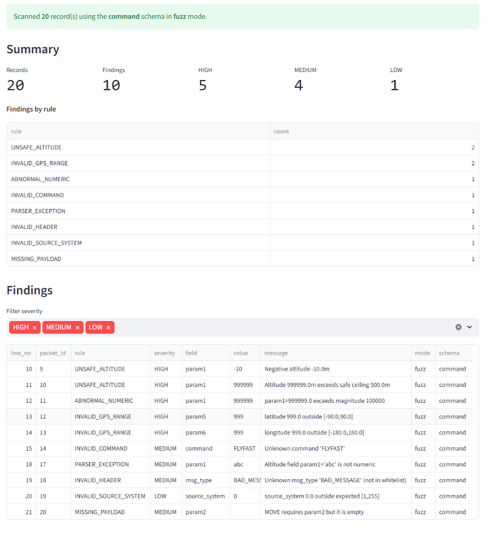

# Mini UAV Protocol Fuzzing Platform

A small web-based platform that ingests UAV-like packet data, runs
field-level + state-aware validation, classifies severity, and exports
consolidated findings as JSON or CSV.

---

## 1. Live Demo

**[https://uav-fuzzer.streamlit.app/](https://uav-fuzzer.streamlit.app/)**


### Scan modes

The platform supports two input schemas (auto-detected from the header
row) and two scan modes (selected from the sidebar). 



1. **Choose a scan mode** 
3. **Upload your file** 
4. **Click ▶ Run scan.** 

The four sections below walk through each combination of scan mode and input file.

---

#### 1.1 Basic mode — telemetry log



Basic mode runs stateless field-level checks on every row of
`telemetry_real_extract.csv`. It only looks at one column at a time and
flags obvious bad values such as out-of-range GPS coordinates or
impossible altitudes. **Result: 4 findings** — two `INVALID_GPS_RANGE`
(lat/lon = 999) and two `UNSAFE_ALTITUDE` (negative + extreme).

---

#### 1.2 Fuzz / anomaly scan mode — telemetry log



Fuzz mode adds context-aware checks that combine multiple columns
(`nav_state`, `arming_state`, `gps_fix_type`, velocity, battery) to spot
anomalies that basic mode cannot. **Result: 8 findings** — same 4 as
basic, plus two `GPS_LOSS` events during navigation, one
`ABNORMAL_VELOCITY`, and one `TAKEOFF_WHILE_DISARMED`. 

---

#### 1.3 Basic mode — command samples



Basic mode runs stateless rules over `mavlink_command_samples.csv`,
checking each packet's header, command name, required payload, GPS
range, altitude bounds, and source-system range. **Result: 9 findings**
covering invalid headers, unknown commands, missing payloads, parser
errors, and out-of-range values.

---

#### 1.4 Fuzz / anomaly scan mode — command samples



Fuzz mode adds the abnormal-numeric check (param magnitudes > 1e5) and
replays each command through the Finite State Machine defined in
`state_transition_rules.csv`, catching illegal sequences that look fine
row-by-row. **Result: 10 findings** — the 9 from basic plus the
extreme-`MOVE` row caught by `ABNORMAL_NUMERIC`.

---

## 2. Code Structure

```
uav_fuzzer/
├── app.py                       # Streamlit UI (thin — UI only)
├── core/                        # Pure-Python detection engine
│   ├── __init__.py              # public re-exports + parse_and_scan helper
│   ├── constants.py             # whitelists, ranges, thresholds
│   ├── findings.py              # Finding dataclass + rule IDs
│   ├── schema.py                # auto-detect schema from header row
│   ├── command_parser.py        # COMMAND schema → CommandPacket
│   ├── command_scanner.py       # COMMAND rules 
│   ├── telemetry_parser.py      # TELEMETRY schema → TelemetryRow
│   ├── telemetry_scanner.py     # TELEMETRY rules (context-aware)
│   └── exporter.py              # JSON / CSV / summary helpers
├── sample_data/
│   ├── mavlink_command_samples.csv
│   ├── telemetry_real_extract.csv
│   └── state_transition_rules.csv
├── requirements.txt
└── README.md
```
